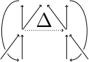

# CHAD: Combinatory Homomorphic Automatic Differentiation


This repo contains a reference implementation of CHAD in Haskell.

CHAD is a method for reverse and forward mode automatic differentiation on expressive functional languages. It performs AD as a compositional, type-safe source code transformation that transforms each language primitive to its (transposed) derivative. This code transformation is homomorphic in the sense of being a structure-preserving functor &mdash; in fact, this homomorphism property forces the definitions of CHAD to be what they are. As a consequence, CHAD admits a straightforward correctness proof that shows that it computes the correct (transposed) derivative of any composite program, provided that the (transposed) derivatives of all language primitives are implemented correctly. This compositionality makes CHAD easy to extend with new language features.

CHAD was introduced in [[1]](https://arxiv.org/abs/2103.15776) (extended and improved version of [[2]](https://arxiv.org/abs/2007.05283)), which was, in turn, inspired by the ideas in [[3]](https://arxiv.org/abs/1804.00746). [[4]](https://openreview.net/forum?id=ryxuz9SzDB) turns out to give a similar treatment of AD of higher order functions as the homomorphic definitions dictated by CHAD.

## Want to try it?

This is a reference implementation, and does not attempt to be high-performance or compatible with other languages/tools.
Indeed, its purpose is to give insight into how the CHAD definitions can work on an actual language in actual code.
It's not all category theory, it's also working code that you can use.

So then you also need to be able to use it.
The code builds using both `cabal` and `stack`.
(If you have a reasonable system and it doesn't build, open an issue.)
Use `cabal repl` or `stack repl` to build the dependencies and open a REPL, and make sure you've got some necessary modules loaded using e.g.:

```
> :m SourceLanguage TargetLanguage TargetLanguage.Simplify STConvert Concrete Concrete.Simplify ToConcrete ForwardAD ReverseAD Types Operation Examples
> :set -XTypeApplications -XDataKinds
```

(Yes, it's the kitchen sink, but none of the modules should export clashing names, so it's fine.)
(The second line sets some extensions necessary to use two of the example programs.)
Then try printing one of the example programs:

```haskell
> putStrLn $ prettyTt $ stConvert $ paper_ex1
let x1 = 2.0 * ctxtVar1 ; x2 = ctxtVar1 * x1 ; x3 = cos x2 ; x4 = ((x1, x2), x3) in x4
> putStrLn $ prettyTt $ stConvert $ paper_ex4 @5
let x1 = \x2 -> ctxtVar2 * x2 ; x3 = map1 (\x4 -> x1 x4) ctxtVar1 ; x5 = sum x3 in x5
```

There are plain Haskell implementations of functions equivalent to these programs in the [Examples](src/Examples.hs) module under the names `paper_ex1_ref` and `paper_ex4_ref` (and similarly for examples 2 and 3 from [[1]](https://arxiv.org/abs/2103.15776)).

Let's try differentiating them!

```haskell
-- Differentiate paper_ex1 using forward AD
> putStrLn $ prettyTt $ df $ paper_ex1
let x1 = let x2 = let x3 = let x4 = ...
```

Oops! Let's simplify first.

```haskell
-- Differentiate paper_ex1 using forward AD, take 2
> putStrLn $ prettyTt $ simplifyTTerm $ df $ paper_ex1
let x1 = 2.0
    x2 = x1 * ctxtVar1
    x3 = ctxtVar1 * x2
in (((x2, x3), cos x3)
   ,\v ->
      let v4 = (v, plus (lscalprod x1 (snd v)) (lscalprod ctxtVar1 zero))
      in let v5 = (v4, plus (lscalprod ctxtVar1 (snd v4)) (lscalprod x2 (snd (fst v4))))
      in ((snd (fst v5), snd v5), lscalprod (0.0 - sin x3) (snd v5)))
```

We can also convert to the concrete language using `toConcrete`.

```haskell
-- Differentiate paper_ex1 using forward AD, take 3
> putStrLn $ prettyCt $ simplifyCTerm allSettings $ toConcrete $ df $ paper_ex1
let x1 = 2.0
    x2 = x1 * ctxtVar1
    x3 = ctxtVar1 * x2
 in ( ((x2, x3), cos x3)
    , \x4 ->
        let x5 = x1 * snd x4
            x6 = plus (ctxtVar1 * x5) (x2 * snd x4)
         in ((x5, x6), (0.0 - sin x3) * x6))

-- Differentiate paper_ex4 using reverse AD
-- Have to provide the value for the type parameter 'n', even if it doesn't matter
-- for the output code
> putStrLn $ prettyCt $ simplifyCTerm allSettings $ toConcrete $ dr $ paper_ex4 @5
( vsum (vmap (\x1 -> ctxtVar2 * x1) ctxtVar1)
, \x2 ->
    let x3 = vreplicate x2
     in ( (zero, sum (map (\x4 -> evalOp EScalProd x4)
                          (zip (toList ctxtVar1) (toList x3))))
        , vzipWith (\x5 -> \x6 -> ctxtVar2 * x6) ctxtVar1 x3))
```

(Actually, I'm cheating a bit here; I'm putting the output through `hindent` first.
Our pretty printer is decent but doesn't do nice indenting.)

<details>
  <summary>How to get nice `hindent` pretty-printing in ghci</summary>

  Put the following in your `~/.ghci`: (if you're not sure where to find that, see the [GHC user's guide](https://downloads.haskell.org/ghc/latest/docs/html/users_guide/ghci.html#the-ghci-files))

  ```haskell
  :def hindent \arg -> let escape x = Prelude.concat (Prelude.map (\c -> if Prelude.elem c "\\\"$`" then ['\\',c] else [c]) x) in Prelude.return (":!echo \"" Prelude.++ escape arg Prelude.++ "\" | hindent --line-length 100")
  :def hindentstr \expr -> Prelude.return (":def! __hindent_str \\_ -> Prelude.return (\":hindent \" Prelude.++ (" Prelude.++ expr Prelude.++ "))\n:__hindent_str\n:undef __hindent_str")
  ```

  This depends on the `hindent` executable being available on your executable search path.
  Then use it e.g. as follows:

  ```haskell
  > :hindent a+b+c
  a + b + c
  > :hindentstr "a+b+c"
  a + b + c
  > :hindentstr prettyCt $ simplifyCTerm allSettings $ toConcrete $ dr $ paper_ex4 @5
  ( vsum (vmap (\x1 -> ctxtVar2 * x1) ctxtVar1)
  , \x2 ->
  -- etc.
  ```

  Modifying this for other pretty printers is an exercise for the reader. :)
</details>

To put your own program through the system, you'll first have to write it as a source language term.
We do not have a convenient parser for that at the moment, so you'll have to write it manually as a value of type `STerm env t` for some `env` and `t`.
See the examples in [Examples.hs](src/Examples.hs) for, well, examples.

## Overview of the implementation

We give a diagrammatic overview of the repository:

.

This implementation defines three languages, all based on the simply-typed lambda calculus.

- The [source language](src/SourceLanguage.hs), which is the input language for the AD transformations.
- The [target language](src/TargetLanguage.hs), the output language of the AD transformations.
  This language is split into two halves, the non-linear fragment (`TTerm`) and, contained therein, the linear fragment (`LinTTerm`).
  See below for what being a "linear function" means in CHAD; it's not the same as linearity as in Linear Haskell!
  (Hint: it's a monoid homomorphism.)
  - The source language is a sublanguage of the target language, as witnessed by the injection given in [STConvert.hs](src/STConvert.hs).
  - There is a simplifier for the target language in [TargetLanguage.Simplify](src/TargetLanguage/Simplify.hs).
- The [concrete language](src/Concrete.hs), which implements some of the abstract operations in the target language (in particular, copowers) in terms of familiar data structures.
  - In comparison with the target language, the concrete language does not contain copower operations any more, nor does it have an explicit representation of linear functions.
    However, it does still have `CZero` and `CPlus` operations that expose the monoid structure of the types in the framework (as witnessed by their `LT` constraint &mdash; see also below).
    The [ToConcrete](src/ToConcrete.hs) module compiles a program in the target language into the concrete language, interpreting copower operations using naive lists and weakening linear functions into regular `->` functions in the process.
    The concrete language should be palatable to people who just want to use the output of AD and don't care about all the fancy stuff that CHAD is doing &mdash; if there is something in Concrete whose semantics are unclear or which is too abstract, let us know. :)
    (Zero and plus don't count, that's just two simple generic functions over types.)
  - There is a simplifier for the concrete language in [Concrete.Simplify](src/Concrete/Simplify.hs).

Both of the simplifiers use functionality from the [Count](src/Count.hs) module in order to correctly count usages of variables in subexpressions.
This is necessary for correct (non-work-increasing) inlining of variables.
For some more information, see the [Count](src/Count.hs) module.

### Well-typed AST

All three languages are in well-typed well-scoped De Bruijn form.
For example, the definition of the target language starts as follows:

```haskell
data TTerm env t where
  Var :: Idx env a -> TTerm env a
  Lambda :: TTerm (a ': env) b -> TTerm env (a -> b)
  Let :: TTerm env a -> TTerm (a ': env) b -> TTerm env b
  App :: TTerm env (a -> b) -> TTerm env a -> TTerm env b
  -- ...
```

The type `t` is the "return type" of the term, whereas `env` is a _list_ of types, giving the environment (i.e. context) of the term.
There are no variable names in this representation; variable references are indices in the list of types given by the `env` type variable.
See also the `Var`, `Lambda`, `Let`, `App` data constructors above.
Some functions for working with indices and environments are defined in [Env.hs](src/Env.hs).

The source language, target language and concrete language include some basic operations like addition and multiplication that are defined in the [Operation](src/Operation.hs) module.

Normally, such abstract syntax trees (ASTs) would carry type information in the form of singletons, so that if one has e.g. a `Var` node in hand, one can read its type from the singleton type variable contained in it.
While that approach allows for great flexibility, a downside is that almost all code that deals with ASTs (and in this project that is almost every line) needs to carry those singleton types around and manipulate them so that the right types end up in the right places.
We felt that this made for a lot of syntactic noise in the code, whereas this is intended to be a _reference implementation_ of the CHAD macros for forward and reverse AD that should showcase them in as clean and clear a way as we are able.

Therefore, we take in a sense the dual approach, and store not the types in the AST, but the operations that we require of the types.
In other words, we add type class constraints to the data constructors that restrict the types in such a way that all the transformations and interpreters are total.

This is visible in the [source language](src/SourceLanguage.hs).
The `LT` type class is implemented for "linear types", in the sense that they have a commutative monoid structure in the way expected by tangent/adjoint accumulation in AD.
The types for which we have implemented `LT` in this reference implementation can be found in [Types.hs](src/Types.hs).
The `LT2`, `LTU` and `LT2U` contraint type synonyms can be found there too.
(See below for the meaning of the `UnLin`, `Df2`, etc. type families.)

### Automatic Differentiation

_For more background, motivation, proofs and definitions, see one of the publications about CHAD linked above, or our pending publication that presents the CHAD framework in a more accessible form on the lambda calculus.
This readme only gives a brief overview to understand how the implementation is structured._

The AD transformations defined in the CHAD framework give a transformation on types as well as a transformation on programs (that, of course, follows the transformation on types).

Every supported type has four types associated to it: the primal and dual types for forward AD and the primal and dual types for reverse AD.
Respectively, these are given by the `Df1`, `Df2`, `Dr1` and `Dr2` type families in [Types.hs](src/Types.hs).
The primal type families are the identity on all types except for function types, but the dual type families can be different more often.
(Because this implementation implements only those operations necessary to illustrate the algorithms, the dual type families are also usually the identity; however, one could set e.g. `Df2 Int = Dr2 Int = ()` and have a perfectly working system.)

Every program in the source language can be transformed by forward AD and by reverse AD.
Forward AD is implemented by the `df` function in [ForwardAD.hs](src/ForwardAD.hs), and reverse AD by the `dr` function in [ReverseAD.hs](src/ReverseAD.hs).
These transformations produce programs in the target language.

**Programs are considered functions of their environment to their return type.**
Hence, if you want to differentiate a function that takes two scalar values (of type `Scal = Double`) and returns a single scalar, write a term of type `STerm '[Scal, Scal] Scal` and differentiate that.

The produced programs have a different environment (context) than the input program, and furthermore they have a different _type_ than the input program.
In particular, given a program `prog` in the source language with environment `env` and type `t`, i.e. a term of type `STerm env t`, the types of the transformed programs are as follows:

```haskell
prog :: STerm env t
df prog :: TTerm (Df1Env env) (Df1 t, LFun (Df2Env env) (Df2 t))
dr prog :: TTerm (Dr1Env env) (Dr1 t, LFun (Dr2 t) (Dr2Env env))
```

The `Df1Env` and `Dr1Env` type families are defined in the same modules as `df` and `dr`, and are nothing more than mapping `Df1` respectively `Dr1` over the environment.
The `Df2Env` and `Dr2Env` type families (also defined there) produce tuple types containing the `Df2` respectively `Dr2` of all the types in the environment; these are the tangents respectively cotangents (adjoints) of the environments.

The environment (arguments) of the transformed terms consists of the primal values corresponding to the environment (arguments) of the original term in the source language.
Evaluating the term in such an environment (on such arguments) produces two results: the primal value corresponding to the original return value of the term, as well as a derivative function.
(Note that if `env ~ Df1Env env` and `t ~ Df1 t`, then `Fst (df prog)` is semantically equivalent to `prog`, and similarly for reverse AD.
This is by design.)

The second result, the derivative function, is a _linear function_ in the sense of a monoid homomorphism (i.e. `f 0 = 0` and `f (a + b) = f a + f b`).
The monoids in question here are precisely those defined by the `LT` type class.

As can be seen in [Types.hs](src/Types.hs), an `LFun a b` is just a function `a -> b`, nothing more, nothing less &mdash; with the crucial difference that the constructor of `LFun` is not exported out of the Types module.
The Types module instead exports a number of combinators that can be used to _build_ linear functions, and it exports a function (`lApp`) to _evaluate_ a linear function.
Thus, assuming that we did our work correctly and the combinators in the Types module always produce linear functions when given linear functions, we are using the Haskell module system to ensure that one cannot (reasonably) construct values of type `LFun a b` that are not actually linear functions.
Note that this also allows us to use the existence of an interpreter for the linear target language fragment (`LinTTerm`) in terms of those linear combinators to prove that the linear target language fragment cannot express a non-linear function.

Again, this readme does not explain in detail how exactly these functions implement differentiation.
For more information, see one of our publications.

### Concrete language

Although the concrete language was already briefly introduced above, we wish to devote some additional space to it for those who think category theory is better left to other people, or perhaps think so today.
(We all have those days.)
The target language in [TargetLanguage.hs](src/TargetLanguage.hs) contains a number of potentially scary features like linear functions that are not actually linear in the sense of Linear Haskell but in some other sense, as well as copowers and some associated operations.

None of that is in the concrete language &mdash; well, the only thing that is left is dedicated primitives for the zero and plus of the monoids that are the "linear types" in the framework.
The `LT` type class in [Types.hs](src/Types.hs) defines Haskell-native interpretations for zero and plus for a number of types that are consistent with what CHAD expects.
(These are really just some well-chosen instances of `Monoid` for those types &mdash; indeed, the "commutative monoids" that CHAD talks about are precisely just instances of `Monoid` in Haskell.)

It would not be hard to compile away those `CZero` and `CPlus` constructors as well, by defining a function that does case-analysis on a singleton type for the type of the zero or plus, and emulates the `LT` instance for that type.
For example, `CPlus a b :: CTerm env (Scal, Scal)` is just `CPair (COp EScalAdd (CPair (CFst a) (CFst b))) (COp EScalAdd (CPair (CSnd a) (CSnd b)))`, except you may want to put those `a` and `b` in a `CLet` binding to prevent duplication of work.
Note that constant values are expressed as a nullary operation in this framework, i.e. `0.0` is `COp (Constant 0.0) CUnit`.
The thing is that to do this, we need to do case analysis on a singleton type, and we carefully avoided having those in this implementation because we didn't actually need it.

The easiest way to add that would be to create a `Type` GADT:

```haskell
data Type t where
  TScal :: Type Scal
  TPair :: Type a -> Type b -> Type (a, b)
  -- etc.
```

and then add a method `inferType :: Type a` to `LT a` and implement it in the obvious way for all instances.
This will work and allow elimination of `CZero` and `CPlus`.

The conversion from the target language to the concrete language is implemented in the `toConcrete` function of the [ToConcrete](src/ToConcrete.hs) module.
If you're curious, that module is also a good place to see what those exotic constructions in the target language actually mean &mdash; because the point of `toConcrete` is that it does a translation that preserves meaning, aside from losing some type safety.

### Testing

This reference implementation of CHAD contains a basic test framework in the [Test](src/Test.hs) module, which uses property tests with the [QuickCheck](https://hackage.haskell.org/package/QuickCheck) library.
There are a number of example programs in the [Examples](src/Examples.hs) module, written in the source language, that are meant to be differentiated.
Among those are the four example programs from [[1]](https://arxiv.org/abs/2103.15776).

See the module documentation of [Test](src/Test.hs) for exactly what properties are being tested.

The test framework makes use of some definitions from [FinDiff.hs](src/FinDiff.hs); this module contains definitions for computing the Jacobian of a function (its matrix of partial derivatives) using finite differencing and other methods.
Finite differencing is the dumb way to compute derivatives: loop over all the inputs of the function, individually tweak each of them a bit, and see how much the output changes by doing that.
It's a fundamentally numerically unstable method, and it's also slow, but it has the tremendous advantage that it requires you to know nothing about the function to be differentiated except that it is sort-of well-behaved (approximately: its actual derivative is sort-of continuous and doesn't get too large).
For this reason, it makes for a very good reference implementation to test an AD implementation against: one doesn't have to write out the correct derivatives by hand, one only has to think of some interesting input program and the test framework does the rest.

To run the test suite, use `cabal run` or `stack test`.
This will start the driver executable in [test/Main.hs](test/Main.hs) that does nothing but call `main` from [Test.hs](src/Test.hs).
